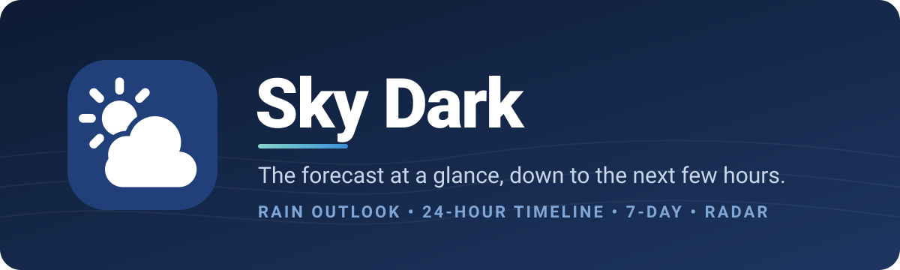
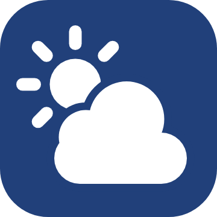
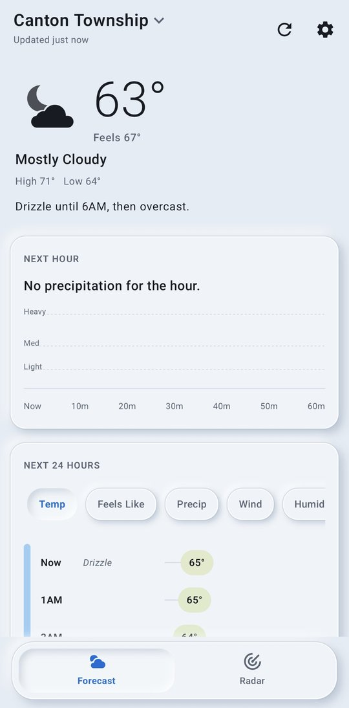
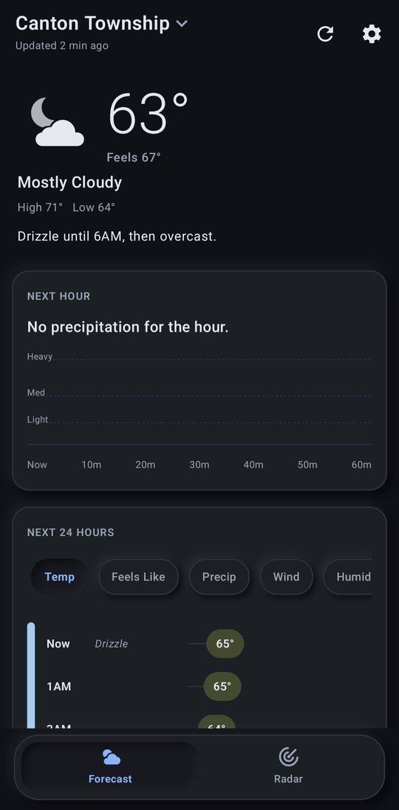
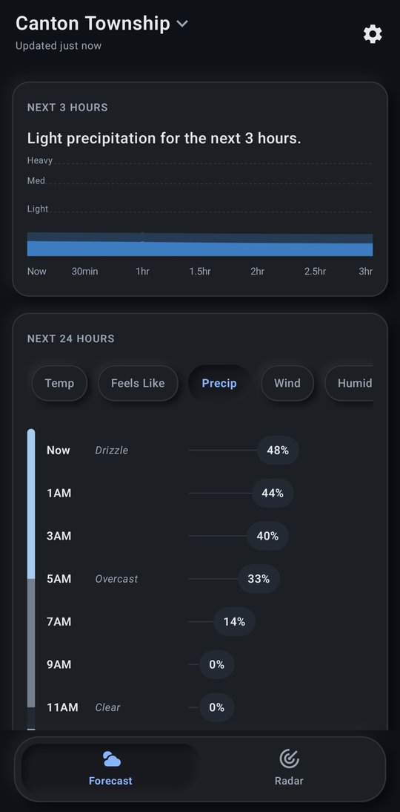

<p align="center">
  
</p>

<p align="center">
  <a href="https://github.com/Gozdor1234/Sky-Dark/releases/latest"></a>
  
  
  <a href="https://github.com/Gozdor1234/Sky-Dark/actions"></a>
</p>

<p align="center"><b>Know when the rain starts. No ads, no clutter, no account.</b></p>

---

**Sky Dark** is a clean, fast Android weather app built around the question you actually ask: is it going to rain on me, and when? It pairs a plain-English rain outlook for the next few hours with a color-coded timeline, a week at a glance, and radar that runs from the past hour into the next three.

## ✨ Highlights

- **Rain outlook in plain English.** "Drizzle starting in 20 min, stopping 1 hr 40 min later," backed by a 3-hour graph of how hard it should come down.
- **A timeline you can read at a glance.** The next 24 hours as a color-coded strip of conditions, with temperature, feels like, chance of rain, wind, humidity, or UV alongside.
- **Radar that looks ahead.** Observed radar for the past hour plus forecast radar for the next three, crossfading smoothly as it plays, over a calm base map or satellite imagery.
- **The week in one view.** Seven days of highs, lows, and rain chances on a shared temperature scale; tap any day for its own hour-by-hour timeline.
- **Built your way.** System, light, dark, and AMOLED black themes, plus an optional Modern style with glass panels and soft shadows.

## 📸 Screenshots

<table>
  <tr>
    <td align="center" colspan="3"><br><sub><b>App icon</b></sub></td>
  </tr>
  <tr>
    <td align="center"><br><sub><b>Forecast, Modern style</b></sub></td>
    <td align="center"><br><sub><b>Dark mode</b></sub></td>
    <td align="center"><br><sub><b>3-hour rain outlook</b></sub></td>
  </tr>
</table>

## 🌦️ What's inside

| | |
|---|---|
| ☀️ **Right now** | Current temperature, feels like, conditions, today's high and low, and a one-line summary of the next 24 hours. Details cover wind and gusts, humidity, dew point, UV, visibility, pressure, cloud cover, sunrise and sunset. |
| 🌧️ **Next 3 hours** | Minute-by-minute precipitation for the first hour, blended with the hourly forecast out to 3 hours, plus a plain-English summary of when it starts and stops. |
| 🕐 **24-hour timeline** | Condition strip with switchable values: temperature, feels like, precipitation chance, wind, humidity, UV. |
| 📅 **7-day forecast** | Daily highs and lows on a shared scale with rain chances; tap a day for its summary, sun times, and hourly timeline. |
| 🗺️ **Radar** | Past hour of observed radar and up to 3 hours of forecast radar, with play, scrub, and jump-to-now. Map or satellite view. US only. |
| ⚠️ **Alerts** | Active weather alerts at the top of the forecast, with full details on tap (US only). |
| 📍 **Places** | Your current location plus any cities you search for and save. |
| 🎨 **Appearance** | System, light, dark, and AMOLED themes, and an optional Modern glass style. |

## 📲 Install it

1. On your Android phone, open the **[latest release](https://github.com/Gozdor1234/Sky-Dark/releases/latest)**.
2. Tap the **`SkyDark-N.apk`** file to download it, then open it.
3. If Android asks, allow **Install unknown apps** for your browser or Files app.
4. If Play Protect warns about an unrecognized developer, tap **Install anyway**. This happens with any app that isn't from the Play Store.
5. Open the app, go to **Settings**, and paste in a free **[Pirate Weather API key](https://pirate-weather.apiable.io)**. The free plan covers personal use.

**Updating:** install the newer APK right over the old one. Your key, places, and settings carry over.

## 🔌 Where the data comes from

| Source | Used for |
|---|---|
| [Pirate Weather](https://pirateweather.net) | Current conditions, minute-by-minute, hourly, and daily forecasts, and alerts (built on NOAA and other public weather models) |
| [Iowa Environmental Mesonet](https://mesonet.agron.iastate.edu/) | Radar tiles: NWS NEXRAD observed radar and NOAA HRRR forecast radar |
| [OpenFreeMap](https://openfreemap.org) | Radar base map (OpenMapTiles, OpenStreetMap data) |
| Esri World Imagery | Satellite view on the radar map |
| [Open-Meteo](https://open-meteo.com/en/docs/geocoding-api) | City search (GeoNames data) |
| [MapLibre GL JS](https://maplibre.org) (BSD-3) | Map rendering, bundled in the app |

Radar colors are the app's own palette: each tile is converted from the standard NWS reflectivity scale on the phone and smoothed to soften the data grid.

## 🛠️ Under the hood

- **Language and UI:** Kotlin 2.0 and Jetpack Compose (Material 3)
- **Radar:** a bundled MapLibre page in a WebView; tiles are fetched, re-colored, and cached by the app
- **Android versions:** minSdk 26 (Android 8.0), targetSdk 34
- **Builds:** every push to `main` builds a signed APK with **GitHub Actions** (`.github/workflows/build-apk.yml`) and publishes it as a release. No local Android setup needed.
- **Light on data:** forecasts refresh at most every 10 minutes unless you pull down to refresh.

<details>
<summary><b>Project layout</b></summary>

```
app/src/main/java/com/nate/skydark/
  MainActivity.kt        App shell, bottom bar, location permission
  WeatherViewModel.kt    Loading, caching, places, settings
  Forecast.kt            Pirate Weather models and parser
  Sky.kt                 Condition buckets, summaries, formatting
  ForecastScreen.kt      Forecast tab: header, rain outlook, week, details
  Components.kt          Timeline, chips, range bars, panels
  WeatherIcon.kt         Weather glyphs drawn in code
  RadarScreen.kt         Radar tab (WebView host)
  RadarTiles.kt          Tile proxy, memory cache, warm-up
  RadarPaint.kt          Radar re-coloring and smoothing
  OtherScreens.kt        Locations and Settings
  Places.kt              Saved settings, GPS, city search
  Theme.kt / Modern.kt   Themes and the Modern glass style
  Net.kt                 HTTP and JSON helpers
app/src/main/assets/
  radar.html             Radar map page (MapLibre)
```

</details>

## ⚠️ Notes

- Sky Dark is a personal hobby project. It isn't affiliated with or endorsed by Pirate Weather, NOAA, the National Weather Service, Iowa State University, Esri, OpenFreeMap, or Open-Meteo.
- Forecasts are model output and can be wrong. For severe weather, follow your local National Weather Service office and official alerts.
- Releases are signed with a private key that only the automated build can unlock, so updates from this page can be trusted to come from the developer.

---

<p align="center">Built by ChickenMyBobbers, one rainy night at a time.</p>
